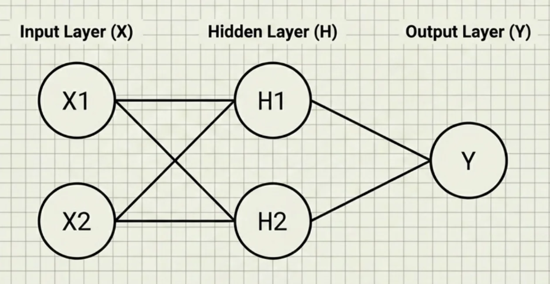
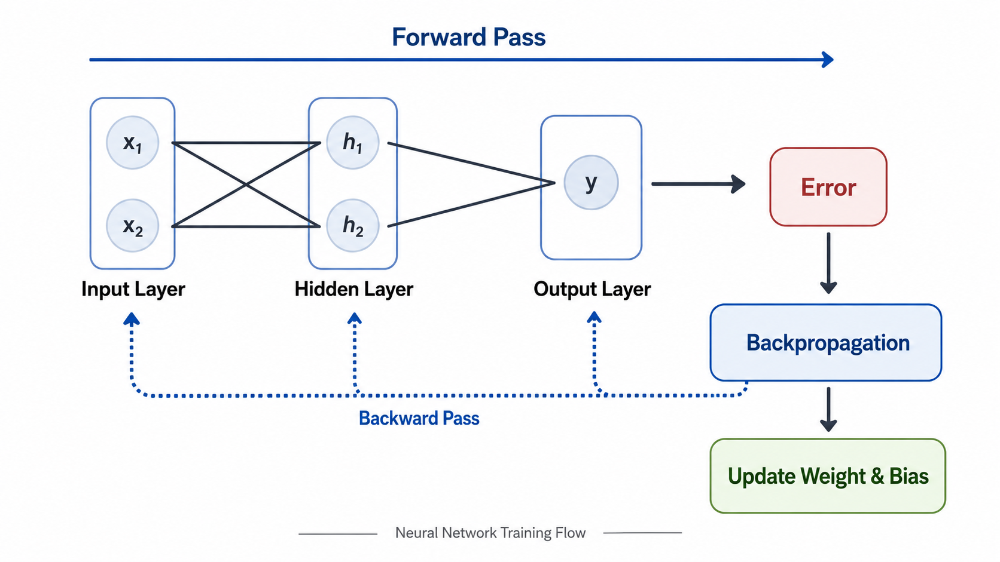
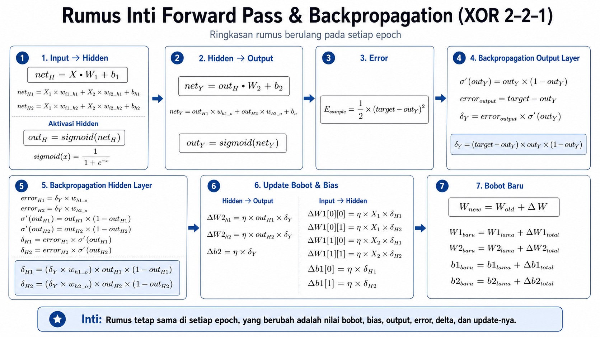

# XOR Backpropagation Simulation

Repository ini berisi notebook pembelajaran untuk memahami cara kerja **Backpropagation** pada jaringan saraf sederhana menggunakan dataset **XOR (Exclusive OR)**. Project ini dibuat untuk menjelaskan proses training secara transparan, mulai dari forward pass, perhitungan error, backward pass, update bobot, hingga evaluasi model setelah konvergen.

> Fokus utama repository ini adalah edukasi: setiap tahapan perhitungan dibuat eksplisit agar mudah dipelajari, diikuti, dan diverifikasi secara manual.

## Informasi Project

| Kategori | Keterangan |
|---|---|
| Mata Kuliah | Kecerdasan Buatan & Robotika |
| Topik | Simulasi Backpropagation pada Dataset XOR |
| Metode | Backpropagation dengan fungsi aktivasi Sigmoid |
| Arsitektur | 2 input neuron, 2 hidden neuron, 1 output neuron |
| Format | Jupyter Notebook |
| Bahasa | Python |

## Ringkasan

Masalah XOR adalah contoh klasik dalam neural network karena tidak dapat diselesaikan oleh model linear sederhana. Dataset ini membutuhkan hidden layer agar jaringan mampu membentuk representasi non-linear.

Notebook dalam repository ini menunjukkan bahwa jaringan dengan arsitektur **2-2-1** dapat mempelajari pola XOR melalui proses training menggunakan algoritma backpropagation.

## Dataset XOR

Aturan XOR:

- Output bernilai `1` jika kedua input berbeda.
- Output bernilai `0` jika kedua input sama.

| X1 | X2 | Target |
|:--:|:--:|:------:|
| 0 | 0 | 0 |
| 0 | 1 | 1 |
| 1 | 0 | 1 |
| 1 | 1 | 0 |

XOR tidak *linearly separable*, sehingga jaringan membutuhkan hidden layer untuk mempelajari hubungan antar input.

Dataset disimpan dalam file [`dataset/xor_dataset.csv`](dataset/xor_dataset.csv) dengan kolom `x1`, `x2`, dan `y`. Notebook membaca file CSV tersebut, lalu mengubahnya menjadi array `X` dan `y` untuk proses training.

## Arsitektur Jaringan

Model menggunakan arsitektur sederhana:



Komponen utama:

- **Input layer**: menerima dua fitur input, yaitu `X1` dan `X2`.
- **Hidden layer**: terdiri dari dua neuron untuk mempelajari pola non-linear.
- **Output layer**: menghasilkan prediksi akhir dalam rentang 0 sampai 1.
- **Sigmoid activation**: digunakan untuk mengubah nilai net input menjadi probabilitas.
- **Backpropagation**: digunakan untuk menghitung gradien dan memperbarui bobot.

## Alur Pembelajaran

Secara umum, proses training dilakukan dengan tahapan berikut:

```text
1. Forward pass
   Hitung output hidden layer dan output layer.

2. Error calculation
   Hitung selisih antara target dan prediksi.

3. Backward pass
   Hitung delta output dan delta hidden menggunakan chain rule.

4. Weight update
   Perbarui bobot dan bias menggunakan gradient descent.

5. Iterasi epoch
   Ulangi proses sampai error menurun dan model konvergen.
```

Diagram alur:



## Konsep Matematika

Fungsi aktivasi sigmoid:

```text
sigmoid(x) = 1 / (1 + e^(-x))
```

Turunan sigmoid:

```text
sigmoid'(x) = sigmoid(x) * (1 - sigmoid(x))
```

Error untuk satu sampel:

```text
E = 1/2 * (target - output)^2
```

Update bobot:

```text
W = W + learning_rate * input * delta
b = b + learning_rate * delta
```

Rumus training loop yang digunakan dalam notebook:



## Isi Notebook

Notebook utama: [`notebook.ipynb`](notebook.ipynb)

Materi yang dibahas:

1. Import library yang dibutuhkan.
2. Definisi dataset XOR.
3. Penjelasan arsitektur jaringan 2-2-1.
4. Implementasi fungsi aktivasi sigmoid dan turunannya.
5. Inisialisasi bobot dan bias dengan seed agar hasil reproducible.
6. Forward pass secara bertahap.
7. Backward pass menggunakan chain rule.
8. Training loop selama beberapa epoch.
9. Visualisasi penurunan error.
10. Evaluasi hasil prediksi model.
11. Analisis bobot akhir setelah training.
12. Eksperimen pengaruh learning rate.

## Struktur Repository

```text
xor-backpropagation-simulation/
+-- dataset/
|   +-- xor_dataset.csv
+-- images/
|   +-- flow.png
|   +-- jaringan.png
|   +-- rumus-loop.png
+-- notebook.ipynb
+-- README.md
+-- requirements.txt
+-- .gitignore
```

## Teknologi yang Digunakan

| Package | Kegunaan |
|---|---|
| `numpy` | Operasi numerik, matrix, bobot, bias, dan perhitungan forward/backward pass |
| `matplotlib` | Visualisasi kurva sigmoid, loss, dan hasil training |
| `notebook` | Menjalankan Jupyter Notebook |
| `ipython` | Environment interaktif untuk eksekusi kode |
| `ipykernel` | Kernel Python untuk Jupyter |

Versi dependency dapat dilihat di [`requirements.txt`](requirements.txt).

## Cara Menjalankan Project

### 1. Clone Repository

```bash
git clone https://github.com/fajri-farid/xor-backpropagation-simulation.git
cd xor-backpropagation-simulation
```

Jika repository sudah ada di komputer lokal, cukup masuk ke folder project:

```bash
cd xor-backpropagation-simulation
```

### 2. Buat Virtual Environment

Windows PowerShell:

```powershell
python -m venv .venv
.\.venv\Scripts\Activate.ps1
```

Windows Command Prompt:

```cmd
python -m venv .venv
.venv\Scripts\activate.bat
```

Linux/macOS:

```bash
python3 -m venv .venv
source .venv/bin/activate
```

### 3. Install Dependency

```bash
python -m pip install --upgrade pip
pip install -r requirements.txt
```

Jalankan cell dari atas ke bawah agar seluruh variabel, bobot, dan hasil training terbentuk secara berurutan.

## Hasil yang Diharapkan

Setelah proses training, model akan mempelajari pola XOR dengan output yang mendekati target:

| Input | Target | Prediksi yang Diharapkan |
|---|:---:|---|
| `[0, 0]` | 0 | Mendekati 0 |
| `[0, 1]` | 1 | Mendekati 1 |
| `[1, 0]` | 1 | Mendekati 1 |
| `[1, 1]` | 0 | Mendekati 0 |

Selain itu, grafik error akan menunjukkan tren menurun seiring bertambahnya epoch. Hal ini menandakan bahwa jaringan berhasil belajar dari dataset.

## Hal yang Bisa Dipelajari

Repository ini dapat digunakan untuk mempelajari:

- Mengapa XOR membutuhkan hidden layer.
- Cara kerja forward pass dalam neural network.
- Cara menghitung error menggunakan Mean Squared Error.
- Cara kerja backward pass dan chain rule.
- Cara bobot dan bias diperbarui selama training.
- Pengaruh learning rate terhadap proses konvergensi.
- Cara membaca hasil training melalui visualisasi error.

## Catatan Pembelajaran

Project ini tidak menggunakan framework deep learning seperti TensorFlow atau PyTorch agar proses backpropagation dapat terlihat jelas dari dasar. Semua perhitungan utama dilakukan menggunakan `numpy`, sehingga cocok untuk memahami mekanisme internal neural network sebelum menggunakan framework yang lebih kompleks.
